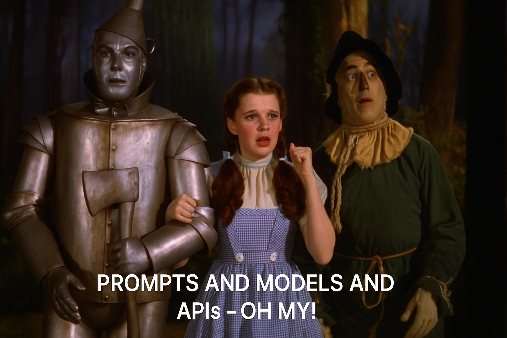

# Eye on the Benchmarks

Eye on the Benchmarks lets you use AI with the simplest possible setup so you can better understand its strengths and weaknesses.

## Prompts and Models and APIs

You run one or more prompts at a time and get responses from one or more models. The application makes API calls behind the scenes to different model providers and records the response from each model (as well as the cost + latency of every request).

### Models

- OpenAI
    - GPT 4o + mini
    - GPT 4.1 + mini + nano
    - o3
    - o4-mini
- Anthropic
    - Claude 3.5 Haiku
    - Claude 3.7 Sonnet
    - Claude 4 Sonnet + Opus
- Google
    - Gemini 2.5 Pro
    - Gemini 2.5 Flash

## Context and Features

### Web Search

You can enable/disable web search, which the models use to look for relevant context online before answering questions.

### File Upload

You can directly choose which PDFs the models will use as context to answer questions.

## Installation

### MacOS

Download the installer [here](https://github.com/mcembalest/eyeonthebenchmarks/releases)

### Windows

Coming soon!
